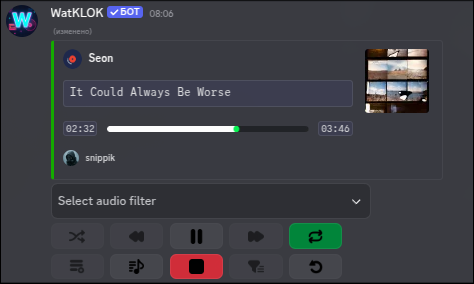

# Discord Music Bot (UnTitles)
- Авторы: [`SNIPPIK`](https://github.com/SNIPPIK), [`GHOST-OF-THE-ABYSS`](https://github.com/GHOST-OF-THE-ABYSS)
- Если хочется поддержать монеткой [`DonationAlerts`](https://www.donationalerts.com/r/snippik)
- Есть идеи прошу в [`discussions`](https://github.com/SNIPPIK/UnTitles/discussions) или на [`Discord Server`](https://discord.gg/qMf2Sv3)

> [!WARNING]
> Эта ветка предназначена для регулярных обновлений, они могут как работать, так и не работать\
> Сейчас ведется публичное тестирование с 0 написанной голосовой библиотеки!!!

> [!TIP]
> Сделано с душой, не забывайте указывать авторство от этого зависит разработка!!!\
> Если найдете ошибку, пожалуйста создайте запрос в [`issues`](https://github.com/SNIPPIK/UnTitles/issues)\
> Поддерживает систему кеширования, ее желательно включить для уменьшения запросов на платформы и в случае поломки вы сможете включать трек из кеша\
> По-умолчанию бот поддерживает Русский, English. Свой язык можно добавить [`тут`](src/services/locale/languages.json) и в [`commands`](src/handlers/commands)

> [!IMPORTANT]
> Если нет ответа от youtube устанавливаем `ytdlp-nodejs`, в таком случае рекомендуется включения кеширования\
> Поддерживается Worker threads в следующих модулях (rest/api), со временем здесь будет больше модулей!!!\
> Есть поддержка [`opus`](src/services/voice/audio/opus.ts), [`sodium`](src/services/voice/sockets/ClientRTPSocket.ts)\
> Никаких Lava, Lavalink, Lavaplayer. Бот предоставляет свой кастомный плеер и свою поддержку платформ\
> Голосовая составляющая была написана с 0, ранее использовалась @discordjs/voice
---

## Доступные команды
| Команда      | Аргументы                            | Описание                                                    | 
|--------------|--------------------------------------|-------------------------------------------------------------|
| /api         | access:(block, unblock)              | **Управление системой APIs внутри бота**                    |
| /bot         | restart:(commands, api, bot, events) | **Управление ботом**                                        | 
| /bot-profile | (avatar)                             | **Управление профилем бота**                                | 
| /filter      | (off, push, disable)                 | **Управление фильтрами аудио**                              |
| /play        | (api, file, replay, stop)            | **Включение музыки, поиск, так-же прочие утилиты**          |
| /remove      | value                                | **Удаление трека из очереди, без возможности восстановить** | 
| /seek        | 00:00, int                           | **Переход к конкретному времени трека**                     |
| /skip        | (back, to, next)                     | **Универсальная команда для управления позицией трека**     |
| /avatar      | {user}                               | **Для просмотра аватара пользователя**                      |
| /voice       | (join, leave, re-configure)          | **Взаимодействие с голосовыми подключениями**               |
| /tribune     | stage:(join, request)                | **Взаимодействие с подключением к трибуне**                 |
- Эти функции есть в плеере и работают в сообщении о текущем треке
  - `replay`, `shuffle`, `queue`, `lyrics`, `repeat (off, on, track)`, `pause/resume`, `stop`

---

## Как запустить проект!
1. Устанавливаем [`node.js`](https://nodejs.org/en)
2. Устанавливаем `FFmpeg`, необходимо выбрать один из вариантов
   - Установить FFmpeg в систему
   - Указать в `env` параметр `ffmpeg.path`
   - Закинуть в `cache.dir`, смотреть [`тут`](https://github.com/SNIPPIK/UnTitles/blob/5b71c70907f62c975ce3ea8ccae6d092e46d9ee6/.env.example#L101)
3. Варианты запуска
   - Исходный вариант (typescript), качаем [тут](https://github.com/SNIPPIK/UnTitles/archive/refs/heads/main.zip)
     - Настраиваем `.env` файл в `./build`
     - Заходим в директорию проекта
     - Открываем терминал
     - npm i && npm run build && npm run start

---

## Диаграмма всего проекта
