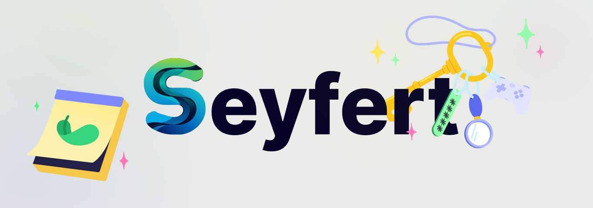

<div align="center">
  <h1>🌟 Discord Music Bot 💫</h1>

<h4>Невероятный бот с собственным голосовым/аудио движком, масштабируемой архитектурой, множеством фильтров и поддержкой 6 музыкальных платформ.</h4>
<h4>Качество аудио превосходит lavalink и использует E2EE 🔐, не верите? Послушайте сами! Работает без просадок даже на ARM!</h4>

  <p>
    <a href="./README.md">
      English
    </a>
    |
    Русский
  </p>

  <p>
    <a href="">
      
    </a>
  </p>

<p>
    <a href="LICENSE.md">
      
    </a>
    <a href="https://github.com/SNIPPIK/Untitles/releases/latest">
      
    </a>
    <a href="https://github.com/SNIPPIK/Untitles/releases">
      
    </a>
    <a href="https://github.com/SNIPPIK/Untitles/graphs/contributors">
      
    </a>
  </p>
</div>

---

## 👥 Авторы

- 👤 [`SNIPPIK`](https://github.com/SNIPPIK)

📢 Об ошибках и недочётах просим сообщать в [`Issues`](https://github.com/SNIPPIK/UnTitles/issues) или [`Discord`](https://discord.gg/qMf2Sv3)  
🚫 Бот не работает 24/7 — он может быть недоступен!

[](https://discord.com/oauth2/authorize?client_id=623170593268957214)
[](https://discord.gg/qMf2Sv3)

> [!WARNING]
> ⚠️ WatKLOK (UnTitles) — это сложный технический проект, который поддерживается исключительно 1 автором `SNIPPIK`  
> Некорректное использование, удаление авторства или присвоение приведут к закрытию публичного репозитория   
> 
> Audio issues  
> Если ваш интернет не стабилен потери будут в любом случае.  
> Полностью устранить `packet lost` не возможно, из-за протокола `UDP` и прочих ограничений `discord`

> [!TIP]
> Рекомендую включить систему кэширования в `.env`, в таком случае можно включать треки даже при полной блокировке платформы  
> Но голосовой системе просто не дозволено терять аудио пакеты даже при критической нагрузке!

> [!WARNING]
> Если используется прокси, учитывайте что `FFmpeg` не поддерживает socks. Для таких задач есть [`STH`](https://github.com/SNIPPIK/SHS)  
> Что-то может не работать, если вы не правильно настроили!!! 
---

### ⚠️ Требования к железу | Данные с Ryzen 7 5700x3D | 1 плеер
- CPU: 0-0.3%
- RAM: `~80 MB`, все зависит от кол-ва треков, нагрузки на платформы, кеша discord!

#### Циклическая система
- Привязка строго к 1 шарду, для уменьшения нагрузки на CPU, 1 шард может тянуть за собой до 1к серверов
---

### 🚀 Особенности движка (UnTitles)
#### 🎖️ Особенности
- Устойчивость к зацикливанию событий, поэтому даже в этом случае звук воспроизводится плавно!!!
```ts
setInterval(() => {
    const startBlock = performance.now();
    while (performance.now() - startBlock < 100) {}
}, 60);

setInterval(() => {
    const startBlock = performance.now();
    while (performance.now() - startBlock < 100) {}
}, 80);

setInterval(() => {
    const startBlock = performance.now();
    while (performance.now() - startBlock < 100) {}
}, 120);

setInterval(() => {
    const startBlock = performance.now();
    while (performance.now() - startBlock < 100) {}
}, 100);
```
#### 🦀 Native Voice Engine (Rust Powered)
- **Высокая производительность**: Основная логика обработки голоса вынесена в нативный модуль на Rust (src-rs), что гарантирует стабильность даже при высоком event loop lag в Node.js.
- **Голосовой движок**: Полная реализация Voice Gateway V8. Стек: WebSocket + UDP + SRTP + Opus.
- **Безопасность**: Поддержка End-to-End Encryption (E2EE 🔐) через протокол Discord DAVE.
- **Таймеры**: Циклические системы с использованием таймера.
- **Умный стриминг**: Не требует внешних opus-кодировщиков для передачи — используется собственный метод парсинга Opus-фреймов.
- **FFmpeg Integration**: Используется для гибкого декодирования аудио и применения сложных фильтров.

#### 🎵 Аудио и Плеер
- **Hot Audio Swap**: Система мгновенного бесшовного перехода между треками.
- **Audio Effects**: Плавный fade-in/fade-out при любых действиях (skip, seek, pause)
- **Фильтры: 16+** встроенных **аудио-фильтров** с возможностью легкого добавления своих через JSON-конфиг [(filters.json)](src/core/player/filters.json)
- **Оптимизация**: Возможность переиспользования аудио без повторной конвертации для треков длительностью до 8 минут
- **Синхронизация**: Прямая синхронизация аудиопотока без искажений, вносимых программными фильтрами.

#### 🌐 Платформы и Парсинг
- **Мультиплатформенность**: Поддержка **YouTube**, **Spotify**, **VK**, **Yandex-Music**, **SoundCloud**, **Deezer**, **Apple (только набросок)**.
- **Умный Fallback**: Если трек недоступен на одной платформе, система автоматически найдет его на другой.
- **Related Tracks**: Автоматический подбор и включение похожих треков для бесконечного прослушивания.
- **Worker Threads**: Все тяжелые операции поиска и парсинга вынесены в отдельные worker-потоки, чтобы не блокировать основной поток бота.
- **Расширяемость**: Модульная архитектура через Dynamic Handler позволяет добавить новую платформу за считанные минуты.

#### 🌍 Локализация и Типизация
- **Языки**: Полная поддержка Русский и English ([**файл с языками**](src/structures/locale/languages.json)).
- **DX (Developer Experience)**: Весь проект строго типизирован (TypeScript + Rust ABI), поставляется с кучей интерфейсов и примеров.
- **Масштабируемость**: Легкое добавление любых языков, поддерживаемых Discord.

---

## 🎛 Интерфейс
- Интерактивные кнопки: действия зависят от состояния плеера
- Поддержка прогресс-бара с тайм-кодами
- Отзывчивый UI — не требует повторного использования команд

#### 📚 Команды
|   Команда | Autocomplete | Аргументы                       | Описание                 |
|----------:|:-------------|:--------------------------------|:-------------------------|
| `/filter` | ✅            | (off, push, disable)            | Аудио-фильтры            |
|   `/play` | ✅            | (query)                         | Проигрывание             |
| `/player` | ✅            | (api, replay, stop, related)    | Расширенное проигрывание |
| `/volume` | ✅            | value                           | Громкость плеера         |
| `/remove` | ✅            | value                           | Удаление трека           |
|   `/seek` | ❌            | 00:00, int                      | Перемотка времени трека  |
|   `/skip` | ✅            | (back, to, next)                | Пропуск треков           |
| `/repeat` | ✅            | type                            | Тип повтора              |
|  `/queue` | ✅            | {destroy, list}                 | Управление очередью      |
|  `/voice` | ✅            | (join, leave, tribune)          | Голосовой канал          |

---
## 🚀 Запуск
- Необходим Node.js, FFmpeg, Rust
- Можно не собирать rust компоненты! Готовые сборки [тут](https://github.com/SNIPPIK/UnTitles/actions/workflows/build.yml)
> Все параметры уже должны быть прописаны в `.env.custom`, берем и переименовываем в .env
```shell
# Клонируем
git clone https://github.com/SNIPPIK/UnTitles
cd UnTitles

# Установка зависимостей
npm i

# Если надо собрать rust компоненты
# Если собирать не хочется качаем готовую сборку и закидываем все по пути build/native
npm run build:native

# Сборка Typescript + настройки + запуск
npm run build && npm run configure && npm run start
```

---
<p>
    <a href="">
      
    </a>
</p>

[](https://www.typescriptlang.org/)
[](https://nodejs.org/en)
[](https://www.seyfert.dev)
[](https://www.npmjs.com/package/ws)
[](https://ffmpeg.org/)
---

# 📊 Диаграмма всего проекта
- Вдруг вам интересно как построен бот
[](.github/images/src.png)