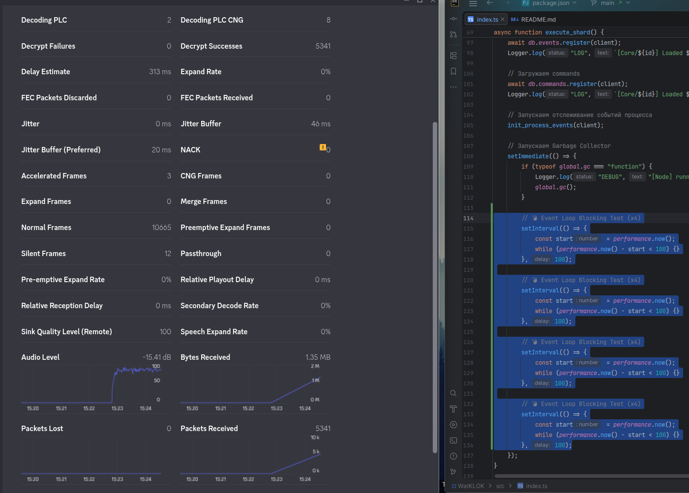

<div align="center">
<h1>WatKLOK</h1>
  <p>
    <a href="./README.md">
      English
    </a>
    |
    Русский
  </p>

  <p>
    <a href="">
      
    </a>
  </p>

<p>
    <a href="LICENSE.md">
      
    </a>
    <a href="https://github.com/SNIPPIK/Untitles/releases/latest">
      
    </a>
    <a href="https://github.com/SNIPPIK/Untitles/releases">
      
    </a>
    <a href="https://github.com/SNIPPIK/Untitles/graphs/contributors">
      
    </a>
  </p>
</div>

---

## 👥 Авторы

Проект разрабатывается и поддерживается одним автором.
* 👤 **[SNIPPIK](https://github.com/SNIPPIK)**


### 💬 Обратная связь
Если вы нашли ошибку, столкнулись с неожиданным поведением или хотите предложить улучшение — создайте **Issue** или присоединяйтесь к **Discord-серверу**.
* 🐞 **Issues:** https://github.com/SNIPPIK/UnTitles/issues
* 💬 **Discord:** https://discord.gg/qMf2Sv3

[](https://discord.com/oauth2/authorize?client_id=623170593268957214)
[](https://discord.gg/qMf2Sv3)
---

> [!IMPORTANT]
> **WatKLOK (UnTitles)** — полностью открытый проект, который в настоящий момент разрабатывается и поддерживается одним человеком. Поэтому выпуск исправлений и новых возможностей зависит от свободного времени автора.

> [!NOTE]
> Для корректной работы некоторых возможностей требуется предварительная настройка окружения (например **FFmpeg**, **native-модули**, **proxy** и другие зависимости).

> [!WARNING]
> При использовании прокси учитывайте, что **FFmpeg** не поддерживает протокол **SOCKS**. Для подобных сценариев рекомендуется использовать **[STH](https://github.com/SNIPPIK/SHS)**.
---

## 🦀 Native Voice Engine (Rust Powered)
Основная логика обработки голосового трафика вынесена в нативный модуль на **Rust** (`rs`). Критические операции выполняются независимо от основного event loop Node.js, что позволяет голосовому движку продолжать работу даже при высокой нагрузке на основной поток.

* **Голосовой движок** — собственная реализация обработки Discord Voice: `UDP` + `SRTP` + `Opus`.
* **Безопасность** — поддержка **End-to-End Encryption (E2EE 🔐)** через протокол **Discord DAVE**.
* **Тайминг и планировщик** — нативная циклическая система с точным таймингом и автоматическим распределением нагрузки между активными голосовыми сессиями.
* **Opus** — обработка и передача Opus-фреймов без необходимости использования внешнего Opus-кодировщика на этапе отправки.
* **FFmpeg Integration** — используется для декодирования аудио, преобразования потока и применения сложных аудиофильтров. Порядок применения фильтров может влиять на итоговый результат.

---

## 🌐 Платформы и парсинг

Поддерживается работа с **YouTube**, **Spotify**, **VK**, **Yandex Music**, **SoundCloud**, **Deezer** и **Apple Music** *(в разработке)*.

* **Умный Fallback** — если трек недоступен на одной платформе, система может автоматически найти альтернативный источник на другой.
* **Related Tracks** — автоматический поиск и добавление похожих треков для продолжения воспроизведения.
* **Worker Threads** — ресурсоёмкие операции поиска и парсинга выполняются в отдельных worker-потоках, не блокируя основной поток Node.js.
* **Расширяемость** — модульная архитектура на основе `Dynamic Handler` позволяет добавлять новые платформы без изменения основной логики плеера.

---

## 🌍 Локализация и типизация

* **Локализация** — полная поддержка **русского и английского языков**. Файлы локализации находятся в [`languages.json`](src/structures/utils/locale/languages.json).
* **DX (Developer Experience)** — проект полностью типизирован с использованием **TypeScript** и типизированного интерфейса взаимодействия с Rust через N-API.
* **Расширяемость** — архитектура локализации позволяет добавлять новые языки без изменения логики команд и интерфейса.

## 🎖️ Устойчивость к блокировке Event Loop
Голосовой движок работает в нативном Rust-модуле и не зависит от event loop Node.js для выполнения критического цикла обработки и отправки аудио.

Даже при существенной нагрузке или временной блокировке основного потока Node.js уже запущенное воспроизведение продолжает обрабатываться нативным голосовым движком.

Это позволяет отделить **управляющую логику Node.js** от **критического аудиопайплайна**, минимизируя влияние задержек event loop на стабильность воспроизведения.

<details>
<summary>Нажми, чтобы открыть</summary>

```ts
// 💣 Event Loop Blocking Test (x4)
for (let i = 0; i < 4; i++) {
  setInterval(() => {
    const start = performance.now();
    while (performance.now() - start < 100) {}
  }, 100 + (i * 10));
}
```

<p>
    <a href="">
      
    </a>
  </p>
</details>

---

## 🎵 [`Качество звука`](https://youtu.be/SwmPmEEDI58)

* **Без искусственных ограничений битрейта** — аудио пайплайн не ограничивает битрейт исходного материала. Теоретически можно передать поток с битрейтом выше стандартных возможностей Discord, однако фактическое качество ограничивается самим Discord и используемым аудиокодеком.
* **Hot Audio Swap** — мгновенное и бесшовное переключение между аудиопотоками без заметных разрывов между треками.
* **Audio Effects** — плавный `fade-in` / `fade-out` при переключении треков и выполнении действий `skip`, `seek` и `pause`.
* **Аудио фильтры** — более 16 встроенных аудио фильтров с возможностью легко добавлять собственные через JSON-конфигурацию [`filters.json`](src/core/player/filters.json).
* **Синхронизация** — точная синхронизация аудиопотока и его обработки без дополнительных искажений, возникающих из-за самого механизма переключения и применения фильтров.

> [!WARNING]
> WatKLOK не может гарантировать отсутствие потерь пакетов после отправки аудиоданных в Discord.
>
> Потери могут возникать на любом участке сетевого соединения между ботом, серверами Discord и клиентом. При нестабильном интернет-соединении клиента это может приводить к пропускам или восстановлению потерянных фреймов средствами Opus.
>
> Полностью исключить потерю пакетов невозможно из-за особенностей UDP и сетевой инфраструктуры Discord. При этом потери, возникающие непосредственно в аудиопайплайне бота, не должны маскироваться под сетевые проблемы — состояние воспроизведения отображается в сообщении текущего трека.
---

## 🎛 Интерфейс

* **Интерактивное управление** — доступные кнопки и действия автоматически изменяются в зависимости от текущего состояния плеера.
* **Прогресс-бар** — отображает текущее положение трека и тайм-коды воспроизведения.
* **Отзывчивый интерфейс** — основные действия доступны непосредственно из плеера и не требуют повторного ввода команд.
* **Управление очередью** — просмотр, удаление и пропуск треков доступны непосредственно из интерфейса.
* **Управление воспроизведением** — поддерживаются повтор, перемотка, изменение громкости и применение аудиофильтров.

#### 📚 Команды
<details>
<summary>Нажми, чтобы открыть</summary>

| Команда         | Autocomplete | Аргументы                  | Описание                                       |
|:----------------|:------------:|:---------------------------|:-----------------------------------------------|
| `/filter`       |      ✅      | `off`, `push`, `disable`   | Управление аудиофильтрами                      |
| `/play`         |      ✅      | `query`                    | Воспроизведение трека или поиск по запросу     |
| `/play search`  |      ✅      | `platform`, `query`        | Поиск и воспроизведение на указанной платформе |
| `/play radio`   |      ✅      | `query`                    | Воспроизведение интернет-радио                 |
| `/play related` |      ✅      | `platform`, `query`        | Поиск и воспроизведение похожих треков         |
| `/player`       |      ✅      | `replay`, `stop`, `volume` | Расширенное управление плеером                 |
| `/volume`       |      ✅      | `value`                    | Изменение громкости плеера                     |
| `/remove`       |      ✅      | `value`                    | Удаление трека из очереди                      |
| `/seek`         |      ❌      | `00:00`, `int`             | Перемотка текущего трека                       |
| `/skip`         |      ✅      | `back`, `to`, `next`       | Переключение и пропуск треков                  |
| `/repeat`       |      ✅      | `type`                     | Настройка режима повтора                       |
| `/queue`        |      ✅      | `destroy`, `list`          | Управление очередью воспроизведения            |
| `/voice`        |      ✅      | `join`, `leave`, `tribune` | Управление голосовым каналом                   |
| `/status`       |      ❌      | —                          | Просмотр состояния бота                        |
| `/reload`       |      ❌      | —                          | Перезагрузка систем бота                       |

</details>


---

## 🚀 Запуск
### Требования
Для запуска необходимы:
* **Node.js**
* **FFmpeg**
* **Rust** — только если требуется самостоятельно собрать native-компоненты
> Собирать Rust-компоненты самостоятельно **не обязательно**. Готовые native-сборки доступны в [GitHub Actions](https://github.com/SNIPPIK/UnTitles/actions/workflows/build.yml).

### Установка
```shell
# Клонируем репозиторий
git clone https://github.com/SNIPPIK/UnTitles
cd UnTitles

# Устанавливаем зависимости
npm install

# Настраиваем окружение
cp .env.custom .env
```
> Все необходимые параметры уже должны быть указаны в `.env.custom`. Перед запуском достаточно скопировать и указать токен в `.env` и при необходимости изменить значения.

### Сборка native-компонентов
Если Rust установлен и native-компоненты необходимо собрать самостоятельно:
```shell
npm run build:native
```
Если собирать Rust-компоненты не требуется, можно использовать готовую сборку из [GitHub Actions](https://github.com/SNIPPIK/UnTitles/actions/workflows/build.yml). Полученные native-модули необходимо разместить в:
```text
build/native
```

### Сборка и запуск
После установки зависимостей и подготовки native-компонентов:
```shell
# Сборка TypeScript
npm run build

# Запуск
npm run start
```

Или одной командой:
```shell
npm run build && npm run start
```